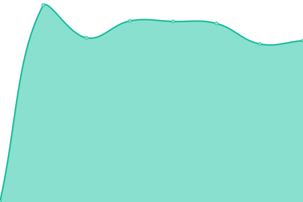

# [📈 Live Status](https://thanksduck.github.io/oas-uptime): <!--live status--> **🟧 Partial outage**

This repository contains the open-source uptime monitor and status page for [Śivam Śukla](https://thanksduck.github.io/oas-uptime), powered by [Upptime](https://github.com/upptime/upptime).

With [Upptime](https://upptime.js.org), you can get your own unlimited and free uptime monitor and status page, powered entirely by a GitHub repository. We use [Issues](https://github.com/thanksduck/oas-uptime/issues) as incident reports, [Actions](https://github.com/thanksduck/oas-uptime/actions) as uptime monitors, and [Pages](https://thanksduck.github.io/oas-uptime) for the status page.

<!--start: status pages-->
<!-- This summary is generated by Upptime (https://github.com/upptime/upptime) -->
<!-- Do not edit this manually, your changes will be overwritten -->
<!-- prettier-ignore -->
| URL | Status | History | Response Time | Uptime |
| --- | ------ | ------- | ------------- | ------ |
|  [One Alias Service](https://1as.in) | 🟩 Up | [one-alias-service.yml](https://github.com/thanksduck/oas-uptime/commits/HEAD/history/one-alias-service.yml) | 

 1128ms
     
 | 

<a href="https://thanksduck.github.io/oas-uptime/history/one-alias-service">100.00%</a>
    

|  [OAS API](https://oas.20032003.xyz/health) | 🟩 Up | [oas-api.yml](https://github.com/thanksduck/oas-uptime/commits/HEAD/history/oas-api.yml) | 

 718ms
     
 | 

<a href="https://thanksduck.github.io/oas-uptime/history/oas-api">100.00%</a>
    

|  [Portfolio Website](https://20032003.xyz) | 🟥 Down | [portfolio-website.yml](https://github.com/thanksduck/oas-uptime/commits/HEAD/history/portfolio-website.yml) | 

 606ms
     
 | 

<a href="https://thanksduck.github.io/oas-uptime/history/portfolio-website">0.00%</a>
    

<!--end: status pages-->

[**Visit our status website →**](https://thanksduck.github.io/oas-uptime)

## 📄 License

- Powered by: [Upptime](https://github.com/upptime/upptime)
- Code: [MIT](./LICENSE) © [Anand Chowdhary](https://anandchowdhary.com), supported by [Pabio](https://pabio.com)
- Data in the `./history` directory: [Open Database License](https://opendatacommons.org/licenses/odbl/1-0/)
